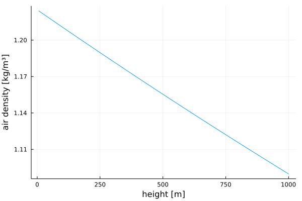

# AtmosphericModels

[](https://github.com/OpenSourceAWE/AtmosphericModels.jl/actions/workflows/CI.yml?query=branch%3Amain)
[](https://codecov.io/gh/OpenSourceAWE/AtmosphericModels.jl)

## Installation
Install [Julia 1.10](http://www.julialang.org) or later, if you haven't already. You can add AtmosphericModels from  Julia's package manager, by typing 
```julia
using Pkg
pkg"add AtmosphericModels"
``` 
at the Julia prompt.

## Exported types
```julia
AtmosphericModel
@enum ProfileLaw EXP=1 LOG=2 EXPLOG=3
```

## Exported functions
```julia
clear(s::AM)
calc_rho(s::AM, height)
calc_wind_factor(am::AM, height, profile_law::Int64=am.set.profile_law)
```
## Wind profile

<p align="center"></p>

The EXPLOG profile law is the fitted linear combination of the exponential and the log law.

## Running the tests
Launch Julia using this project and run the tests:
```julia
julia --project
using Pkg
Pkg.test("AtmosphericModels")
```

## Running the examples
If you check out the project using git, you can more easily run the examples:
```
git clone https://github.com/OpenSourceAWE/AtmosphericModels.jl
cd AtmosphericModels.jl
```
Launch Julia using this project and run the example menu:
```julia
julia --project
include("examples/menu.jl")
```
The first time will take some time, because the graphic libraries will get installed, the second time it is fast.

## Usage
```julia
using AtmosphericModels
am = AtmosphericModel()

const profile_law = Int(EXPLOG)
height = 100.0
wf = calc_wind_factor(am, height, profile_law)
```
The result is the factor with which the ground wind speed needs to be multiplied
to get the wind speed at the given height.

## Using the turbulent wind field
You can get a wind vector as function of x,y,z and time using the following code:
```
using AtmosphericModels, KiteUtils

set_data_path("data")
set = load_settings("system.yaml"; relax=true)
am::AtmosphericModel = AtmosphericModel(set)

@info "Ground wind speed: $(am.set.v_wind) m/s"

wf::WindField = WindField(am, am.set.v_wind)
x, y, z = 20.0, 0.0, 200.0
t = 0.0
vx, vy, vz = get_wind(wf, am, x, y, z, t)
@time get_wind(am, x, y, z, t)
@info "Wind at x=$(x), y=$(y), z=$(z), t=$(t): v_x=$(vx), v_y=$(vy), v_z=$(vz)"
@info "Wind speed: $(sqrt(vx^2 + vy^2 + vz^2)) m/s"
```
It is suggested to check out the code using git before executing this example,
because it requires that a data directory with the correct files `system.yaml`
and `settings.yaml` exists. See below how to do that.

## Air density
```julia
using AtmosphericModels, BenchmarkTools, KiteUtils
am = AtmosphericModel(se())
@benchmark calc_rho(am, height) setup=(height=Float64((6.0+rand()*500.0)))
```
This gives 4.85 ns as result. Plot the air density:
```julia
heights = 6:1000
rhos = [calc_rho(am, height) for height in heights]
plot(heights, rhos, legend=false, xlabel="height [m]", ylabel="air density [kg/m³]")
```
<p align="center"></p>

## Further reading
These models are described in detail in [Dynamic Model of a Pumping Kite Power System](http://arxiv.org/abs/1406.6218).

## Licence
This project is licensed under the MIT License. Please see the below WAIVER in association with the license.

## WAIVER
Technische Universiteit Delft hereby disclaims all copyright interest in the package “AtmosphericModels.jl” (models for airborne wind energy systems) written by the Author(s).

Prof.dr. H.G.C. (Henri) Werij, Dean of Aerospace Engineering

## See also
- [Research Fechner](https://research.tudelft.nl/en/publications/?search=Uwe+Fechner&pageSize=50&ordering=rating&descending=true)
- The application [KiteViewer](https://github.com/ufechner7/KiteViewer)
- the package [KiteUtils](https://github.com/ufechner7/KiteUtils.jl)
- the packages [KiteModels](https://github.com/ufechner7/KiteModels.jl) and [WinchModels](https://github.com/aenarete/WinchModels.jl) and [KitePodModels](https://github.com/aenarete/KitePodModels.jl)
- the packages [KiteControllers](https://github.com/aenarete/KiteControllers.jl) and [KiteViewers](https://github.com/aenarete/KiteViewers.jl)

