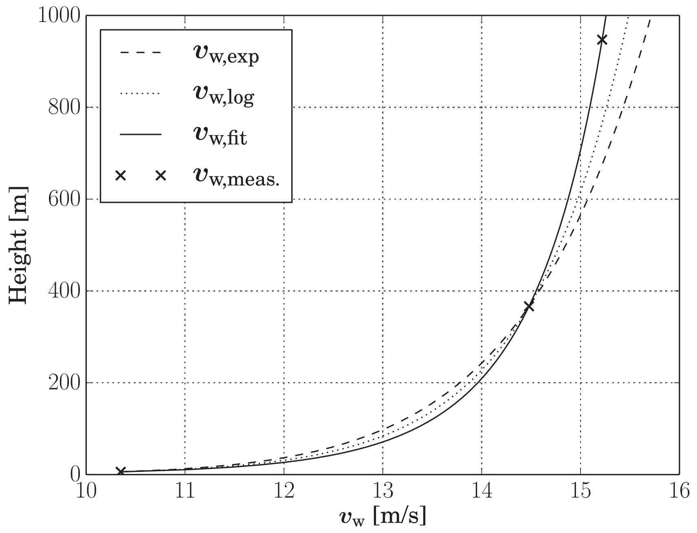

```@meta
CurrentModule = AtmosphericModels
```
# Wind Fields

## Wind shear, scenario Maasvlakte, NL
Maasvlakte is a location close to Rotterdam, The Netherlands, very close to the sea (near-shore).

To determine the wind speed $v_\mathrm{w}$ at the height of the kite and at
the height of each tether segment, the power law **Stull (2000)** and the log
law, which according to **Burton (2001)** p. 20 is more accurate than the least-
square power law, are used. Input parameters are the ground wind speed
$v_\mathrm{w,ref}$ and the current height $z$ of the kite or tether segment. The
ground wind speed used in this paper was measured at $z_\mathrm{ref} = 6.0~m$.
The power law establishes the relationship between $v_\mathrm{w}$ and $v_\mathrm{w,ref}$ as

$v_\mathrm{w} = v_\mathrm{w,ref}\left(\frac{z}{z_\mathrm{ref}}\right)^{\alpha}$

with the exponent $\alpha$ as fitting parameter. The logarithmic law can be written in the following form

$v_\mathrm{w,log} = v_\mathrm{w,ref}\left( \frac{\mathrm{log}(z/z_0)}{\mathrm{log}(z_\mathrm{ref}/z_0)}\right)$

where $z_\mathrm{ref}$ is the reference height and $z_0$ is the roughness length. For
the paper **Fechner (2015)** not only the ground wind speed $v_\mathrm{w,ref}$ is measured, but
once per flight additionally the wind speed at two more heights, $z_1$
and $z_2$. Then, a wind profile is fitted to these three wind speeds. To
make a fit with three (speed, height) pairs possible, Eqs. (2) and (1)
are combined in the following way

$v_\mathrm{w} = v_\mathrm{w,log} + K (v_\mathrm{w,log} - v_\mathrm{w,exp})$

The fit is done by varying the surface roughness $z_0$ and $K$ until $v_\mathrm{w}$ according to Eq. (3) matches the measured wind speed at all three heights. The exponent $\alpha$ is chosen according to

$\alpha = \frac{\mathrm{log} (v_\mathrm{w,exp}(z_1)) / v_\mathrm{w,ref}}{\mathrm{log}(z) - \mathrm{log}(z_\mathrm {ref})}$

which results in $v_\mathrm{w,exp}(z_1) = v_\mathrm{w,log}(z_1)$.


The following result was achieved:

| Parameter| Value  |
|:--------:|:------:|
| K        | 1.0    |
|$\alpha$  | 0.08163| 
|$z_0$     | 0.0002 |



To use this atmospheric model, execute:
```julia
set_data_path("data")
set = load_settings("system_nearshore.yaml"; relax=true)
am::AtmosphericModel = AtmosphericModel(set)
```

## Wind shear, scenario Cabauw, NL
Wind data from Royal Netherlands Meteorological Institute (KNMI 2011) at the
inland location Cabauw, The Netherlands was used and the wind profile fitted, using the power law according to the following equation:

$v_\mathrm{w} = v_\mathrm{w,ref}\left(\frac{z}{z_\mathrm{ref}}\right)^{\mathrm{\alpha}}$

where z is the height and $\alpha$ the power coefficient. 

A coefficient **$\alpha$ = 0.234** was obtained, which is
significantly larger than for the location Maasvlakte. This is to be expected because Cabauw is a lot further away from the shore than Maasvlakte.

## Wind turbulence, scenario Cabauw
A one year measurement time series from the wind measurement tower in Cabauw was used by **Fechner (2016)**
to calibrate the wind speed, wind shear and wind turbulence of this scenario.

The relative turbulence intensity I, the ratio of the standard deviation of the wind speed
within 10 minute intervals and the 10 minute wind speed average ws calculated, based on
the Cabauw data set from Royal Netherlands Meteorological Institute **KNMI (2011)**.
Three scenarios are chosen for the simulation: The average ground wind speed of
**3.483 m/s**, the wind speed for nominal power of **5.324 m/s** and the maximal wind speed
for operation without the need to depower the kite of **8.163 m/s**.

| $v_{w,g}$  | $I_{99}$ |$I_{197}$| Description      |
|:----------:|:--------:|:-------:|:-----------------|
|  3.483 m/s  |    8.5%  | 6.3%    |Average wind speed|
|  5.324 m/s  |    9.7%  | 7.2%    |Nominal wind speed|
|  8.163 m/s  |    9.8%  | 7.9%    |High wind speed   |

The reference height for the ground wind speed is 6m. The reason for choosing 6m instead of the standard height of 10m is that during the flight tests only a 6m mast was available.

A correction factor was used to adapt the turbulence from the IEC model to the measured values.
In `settings.yaml`, this line defines the correction factors: `rel_turbs:   [0.342, 0.465, 0.583]`.

As you see, in this scenario the turbulence increases with the average wind speed and decreases
with the height.

The turbulence is modelled in three dimensions, using the Mann model as described
by **Mann (1994)** and **Mann (1998)**. The resulting homogeneous velocity field is obtained
by a 3D FFT (Fast Fourier Transformation) of the spectral tensor. Randomization is done by a white noise vector to give the wave numbers a random phase and amplitude.
A wind field of 4050 x 100 x 500 points with 2 m resolution is pre-calculated. To obtain the 3D wind speed vector at any given position a 3rd order spline interpolation is
used. To take the time dependency of the wind into account, the product of the simulation time and the average wind speed at the height of the kite is added to the x-coordinate before the wind vector lookup. The turbulent component of the wind field is periodic in all directions, because it is generated using reverse FFT. The size of the wind field is chosen such that the wind speed sequence repeats every 13.5 minutes at a wind speed of 10 m/s.

To use this atmospheric model, execute:
```julia
set_data_path("data")
set = load_settings("system.yaml"; relax=true)
am::AtmosphericModel = AtmosphericModel(set)
```
If the file `windfield_4050_100_500_70_1.0_5.3.npz`, which contains the required wind field does not exist it will be created automatically. This might take 30s, but is required only once.

**Known limitation:** Only three of the parameters that determine the wind field
are encoded in the filename. Therefore, if you change one of the other parameters the wrong file might be loaded. Workaround: Delete all `*.npz` files in the data folder before changing another parameter than `grid`, `use_turbulence` or `v_wind_gnds`.

**References**

**Fechner 2015** Fechner, U., Vlugt, R. V. D., Schreuder, E. & Schmehl, R. (2015). Dynamic Model of
a Pumping Kite Power System. Renewable Energy, 83, 705–716. [doi:10.1016/j.renene.2015.04.028](https://doi.org/10.1016/j.renene.2015.04.028)

**Fechner 2016** Fechner, U. (2016). A Methodology for the Design of Kite-Power Control Systems (Doctoral thesis, Delft University of Technology). 87-91. [doi:10.4233/uuid:85efaf4c-9dce-4111-bc91-7171b9da4b77](https://doi.org/10.4233/uuid:85efaf4c-9dce-4111-bc91-7171b9da4b77)

**KNMI 2011** KNMI, The Royal Netherlands Meteorological Institute. (2011). Cesar Tower Meteoro
logical Profiles (Wind Data from Cabauw, The Netherlands), validated. Retrieved
from [www.cesar-database.nl](http://www.cesar-database.nl)

**Stull 2000** Stull, R. (2000). Meteorology for scientists and engineers: A technical companion book with Ahrens' Meteorology Today (2nd ed.). Brooks/Cole.

**Burton 2001** Burton, T., Sharpe, D., Jenkins, N., & Bossanyi, E. (2001). Wind energy handbook. Wiley. https://doi.org/10.1002/0470846062

**Mann 1994** Mann, J. (1994, April). The spatial structure of neutral atmospheric surface-layer turbulence. Journal of Fluid Mechanics, 273, 141. [doi:10.1017/S0022112094001886](https://doi.org/10.1017/S0022112094001886)  

**Mann 1998** Mann, J. (1998, October). Wind field simulation. Probabilistic Engineering Mechanics, 13(4), 269–282. [doi:10.1016/S0266-8920(97)00036-2](https://doi.org/10.1016/S0266-8920(97)00036-2)

